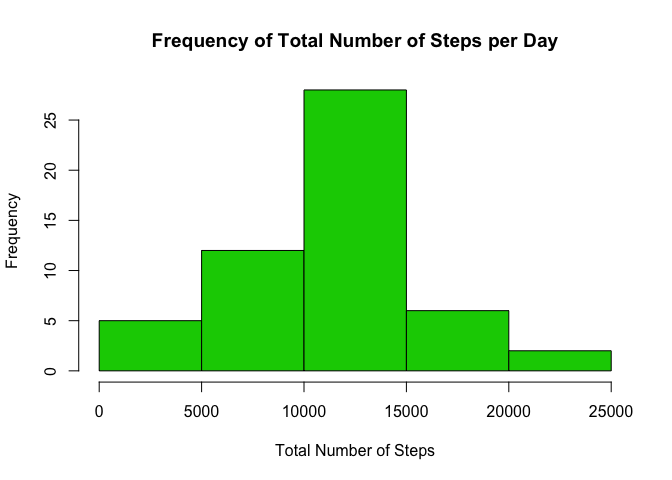
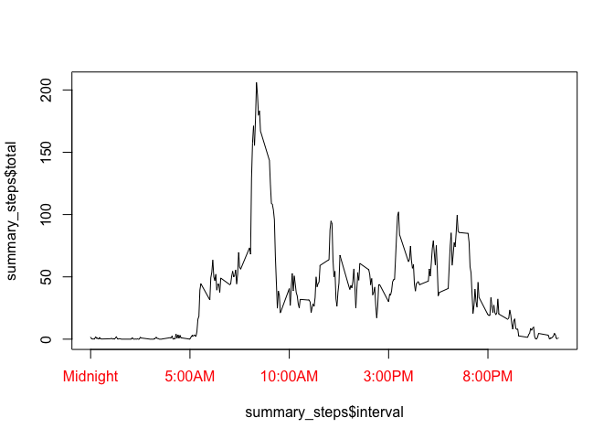

# Reproducible Research: Peer Assessment 1


## Loading and preprocessing the data


```r
library(xtable)
library(dplyr)
```

```
## 
## Attaching package: 'dplyr'
## 
## The following object is masked from 'package:stats':
## 
##     filter
## 
## The following objects are masked from 'package:base':
## 
##     intersect, setdiff, setequal, union
```

```r
activity<-read.table("activity.csv", header=TRUE, stringsAsFactor=FALSE, sep=",")
activity_wo_na<-activity[!is.na(activity$steps),]
```


## What is mean total number of steps taken per day?

```r
grouped_by_day<- group_by(activity_wo_na, date)
summary_steps <- summarise(grouped_by_day,
  total = sum(steps))
  avgsteps<-mean(summary_steps$total)
   mediansteps<-median(summary_steps$total)
   hist(summary_steps$total, xlab="Total Number of Steps", main="Frequency of Total Number of Steps per Day", col=1, breaks=12)
   abline(v = avgsteps, col = 7, lwd = 2)
```

 

## What is the average daily activity pattern?

```r
grouped_by_int<- group_by(activity_wo_na, interval)
 summary_stepsint <- summarise(grouped_by_int,  avg = mean(steps))
 x<- c("Midnight", "5:00AM", "10:00AM", "3:00PM", "8:00PM")
plot(summary_stepsint$avg~summary_stepsint$interval, type="l",  xaxt="n")
 axis(1, at=c(0,500,1000,1500,2000),labels=x, col.axis="red")
```

 


## Imputing missing values

```r
activity_na_replace<-activity

M<-summary_stepsint$interval
for(i in M) 
  {
	int_avg<-summary_stepsint[summary_stepsint$interval==i,]$avg
	if(dim(activity_na_replace[activity_na_replace$interval==i & is.na(activity_na_replace$steps),])[1]>0)
		{
activity_na_replace[activity_na_replace$interval==i & is.na(activity_na_replace$steps),]$steps = int_avg
		}
			 			 
	}
	
grouped_by_day<- group_by(activity_na_replace, date)
summary_steps <- summarise(grouped_by_day,
  total = sum(steps))
  avgsteps<-mean(summary_steps$total)
   median(summary_steps$total)
```

```
## [1] 10766.19
```

```r
   hist(summary_steps$total, xlab="Total Number of Steps", main="Frequency of Total Number of Steps per Day", col=3)
abline(v = avgsteps, col = "blue", lwd = 2)
```

 


## Are there differences in activity patterns between weekdays and weekends?
