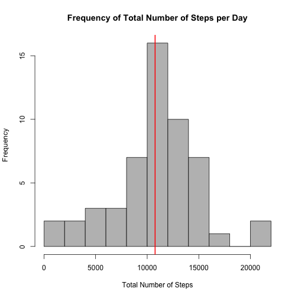
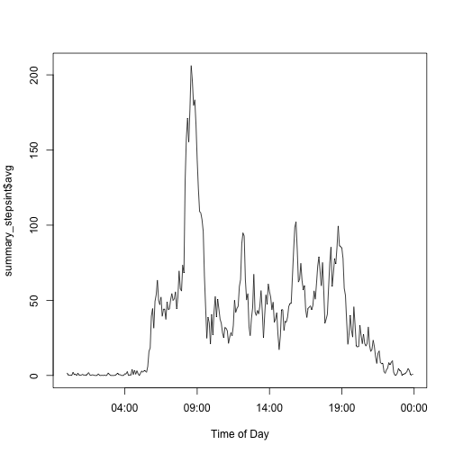
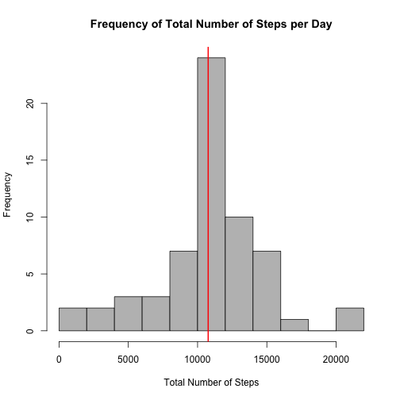

```r
require(knitr)
opts_chunk$set(echo = TRUE, cache = TRUE, cache.path = "cache/", fig.path = "figure/")
```

## Summary

This document investigates daily activity in terms of steps taken within five minute intervals.  The average and median are considered to determine how the data is distributed.  In addition, daily patterns are addressed by average steps per interval frequencies for all days and days broken up by weekend and weekday.


## Loading and preprocessing the data


```r
#required libraries
library(dplyr)
library(lattice)

#load data
activity<-read.table("activity.csv", header=TRUE, stringsAsFactor=FALSE, sep=",")

#omit NA values
activity_wo_na<-activity[!is.na(activity$steps),]
```


## What is mean total number of steps taken per day?

```r
#group by day and sum steps taken
grouped_by_day<- group_by(activity_wo_na, date)
summary_steps <- summarise(grouped_by_day,total = sum(steps))

#find the mean and median
avgsteps<-mean(summary_steps$total)
mediansteps<-median(summary_steps$total)

#Construct a histogram with mean line
hist(summary_steps$total, xlab="Total Number of Steps", main="Frequency of Total Number of Steps per Day", col=8, breaks=12)
abline(v = avgsteps, col = 2, lwd = 2)
```

 
The average daily activity is 1.0766189 &times; 10<sup>4</sup> steps with median 10765.  The median and mean are very similar when the NA values have been dropped.  Therefore, the data is evenly distributed around the mean.


## What is the average daily activity pattern?

```r
#Group by intervals and find average
grouped_by_int<- group_by(activity_wo_na, interval)
summary_stepsint <- summarise(grouped_by_int,  avg = mean(steps))

#plot
plot(strptime(sprintf("%04d", summary_stepsint$interval), format="%H%M"), summary_stepsint$avg, type="l", xlab="Time of Day")
```

 
There is a significant spike in average acitivity in early morning and fairly large average steps through the late evening.   During the hours of 22:00 - 5:00 there is relatively no activity.


## Imputing missing values

The previously omitted missing values will be replaced with the average for the 5 minute interval in which the NA occurred.  This replacement was chosen in order to replace missing data with the most accurate apprximately for the relevant interval.

The histogram, average, and median for this dataset is presented below.   


```r
#copy original data
activity_na_replace<-activity

#copy the intervals to an individual vector to loop over
M<-summary_stepsint$interval
for(i in M) 
  {
#The average for this interval
  int_avg<-summary_stepsint[summary_stepsint$interval==i,]$avg
  
#if there are entries which are NA for this interval, replace them with the interval average  
	if(dim(activity_na_replace[activity_na_replace$interval==i & is.na(activity_na_replace$steps),])[1]>0)
		{
activity_na_replace[activity_na_replace$interval==i & is.na(activity_na_replace$steps),]$steps = int_avg
		}		 			 
	}


#group by day the new data set, find mean/median, and plot 
grouped_by_day<- group_by(activity_na_replace, date)
summary_steps <- summarise(grouped_by_day,
  total = sum(steps))
  
avgsteps<-mean(summary_steps$total)
mediansteps<-median(summary_steps$total)

hist(summary_steps$total, xlab="Total Number of Steps", main="Frequency of Total Number of Steps per Day", col=8, breaks=12)
abline(v = avgsteps, col = 2, lwd = 2)
```

 
The average daily activity is 1.0766189 &times; 10<sup>4</sup> steps with median 1.0766189 &times; 10<sup>4</sup>.  The result of using the interval average is the mean and median for the average steps per day be the same.


## Are there differences in activity patterns between weekdays and weekends?

The following data is presented twice.  Once as panels per the assignment description, and once as a superimposed graph.  I included both, because I find the non-panel version easier for comparisons.


```r
#create a factor that distinguishes weekday and weekend
activity_na_replace$wday<-as.character(wday(activity_na_replace$date))
activity_na_replace[activity_na_replace$wday==1 | activity_na_replace$wday==6,]$wday = "Weekend"
activity_na_replace[activity_na_replace$wday!="Weekend",]$wday = "Weekday"
activity_na_replace$wday<-as.factor(activity_na_replace$wday)

#group data by interval and weekend/weekday
grouped_by_int<- group_by(activity_na_replace, interval, wday)
 summary_stepsint <- summarise(grouped_by_int,  avg = mean(steps))

#Plot the data
int<- as.POSIXct(strptime(sprintf("%04d", summary_stepsint$interval), format="%H%M"))

xyplot(summary_stepsint$avg~int|summary_stepsint$wday,type="l", auto.key=TRUE, scales=list(x=list(at=NULL)), xlab="Time (Between 00:00 and 23:55)", lwd=3)
```

 

```r
xyplot(summary_stepsint$avg~int, groups =summary_stepsint$wday,type="l", auto.key=TRUE, scales=list(x=list(at=NULL)), xlab="Time (Between 00:00 and 23:55)", lwd=3)
```

 
From the graph, one can see that the both weekend and weekdays have spikes in early morning;  however general activity starts earlier on weekday mornings.  Weekend afternoons also have more activity on average than weekday afternoons.  There is also some extra late activity on weekends.

